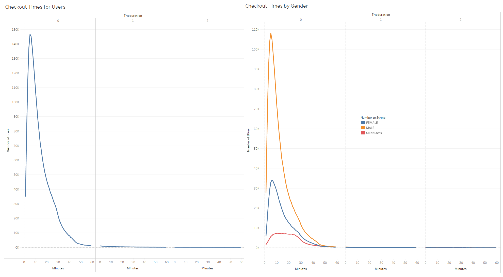
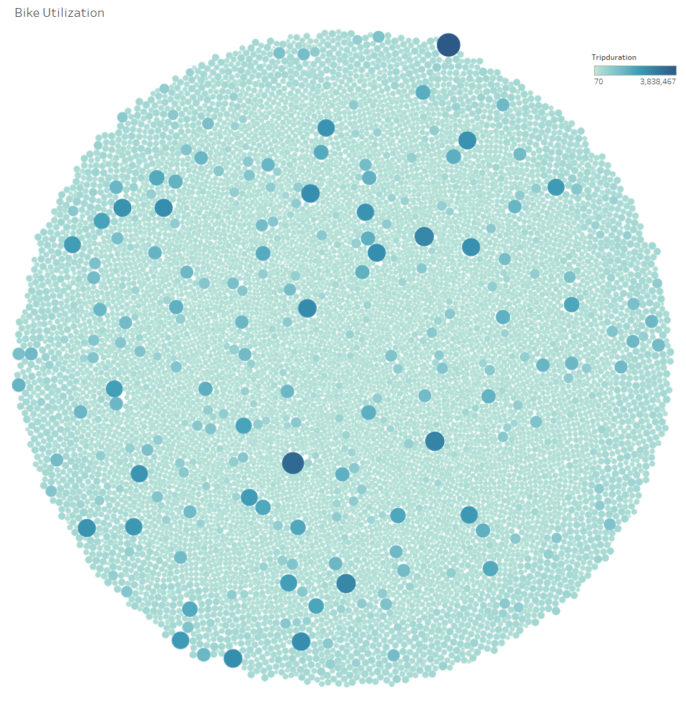
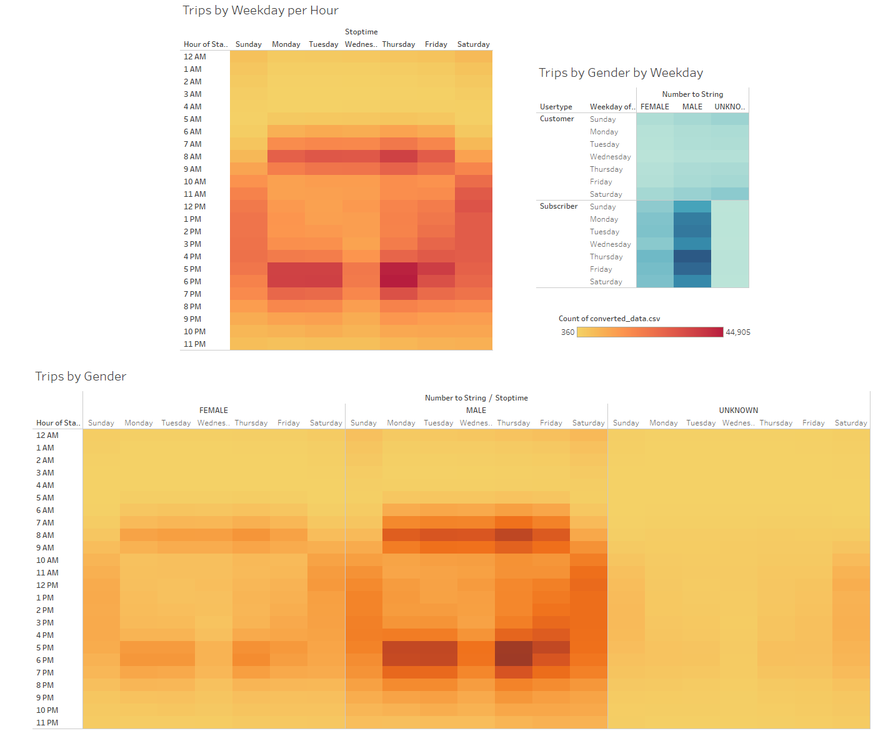

# Citi Bike Data Analysis

## Project Purpose
Analyze the data taken from New York City's CitiBike usage from the month of August 2019 to understand the rider patterns, and to gather insights that can be useful for new bike rental startups. Tableau will be used to create easy-to-understand visualizations.

## Resources
- Software: 
	- Tableau
	- Python 3.8.5
	- Pandas
	
## Results

### Trip Duration

One important factor that go into how many bikes will be needed for a given population is the total trip duration of each bike. 

As we can see here, the vast majority of users will rent bikes for no more than 30 minutes, with almost negligible amount renting the bikes for more than an hour. We can see that this trend is followed regardless of gender. Another trend that we can see regarding gender, is that male riders seem to be the overwhelming majority of the total users, which may be important for creating ad campaigns for a male dominated target audience.

### Bike Repair and Maintenance

In operating a bike rental business, one of the largest business expenses would be repairing and maintaining all of the bikes. Bikes that accumulate a lot mileage can be seen below, which larger, darker circles indicating which bikes need to checked more often during a routine maintenance.

A very important factor to consider is when bikes are rented most commonly throughout the day, which will help new bike rental startups decide when the optimal time to perform bike maintenance will be. Looking at the heat maps below, we can clearly see that bikes are most often rented during common work hours on the weekdays (~7AM - ~7PM) with the highest rates of rentals occurring at the start and end of the work hours. According to the data, bike maintenance would be easiest to be done during the slowest business times, from midnight to 4AM. 

### Subscribers vs One-time-users

Looking at the heat map on the top right, we can see that the majority of rentals are done by subscribers, compared to one time users. New startups should definitely consider a subscription plan for local renters who may use bikes as a way to commute to and from work.

## Summary

There are many trends and insights that can be deduced looking at the visualizations above that would be extremely useful for any bike rental company.

### Trends
- Most bikes are rented for under 30 minutes.
- Males are the majority of users for bike rentals.
- Bikes are rented most commonly at the start and end of work hours.
- Subscribers rent more often than one-time-users.

### Insights
- The target demographic for any ad campaigns should target males at first, and then switch to females when the male market is saturated.
- Bike maintenance should be performed during the slowest times of the day in the very early AMs.
- Creating a subscription service will help incentivize local commuters to joining.

### Further Analysis
For more information, I would like to create a heatmap over a map of the area, to help understand which types of neighborhoods have the most rentals. This would give us an insight on how to distribute the total supply of bikes to each given neighborhood. Another visualization I would like to make in the future is a map of each bike and the location of the end points vs start points to gain an insight of how to redistribute bikes from areas of low rental traffic to high rental traffic.

## Link to my Tableau Public page: [CitiBike Data Analysis Dashboard](https://public.tableau.com/views/CitiBikeDataAnalysis_16268649968870/CitiBikeDataAnalysis?:language=en-US&publish=yes&:display_count=n&:origin=viz_share_link)